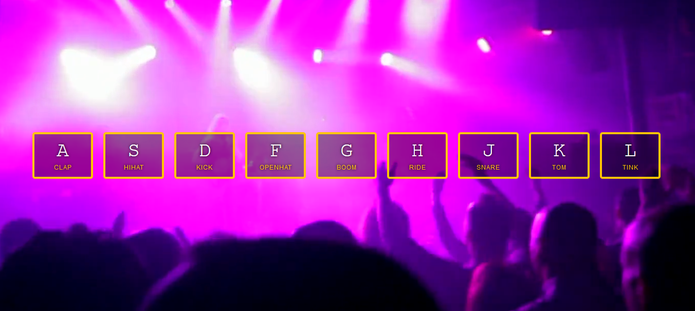

# Drumkit

###### August 2020

_This drumkit is the first tutorial in Wes Bos' JavaScript 30 Course and I really enjoyed making it! I've made similar audio apps before so the ideas I used today weren't completely foreign to me but I definitely learnt some new things about events which was really helpful. I custom styled it with a video background of a concert so I feel like a rock star when I'm playing it!_

## Main Learning Points:

- Key events
- Playing audio
- Listening for the transition end event
- Attribute selectors (I used one for the first time!)

## Built with:

- HTML
- CSS
- JavaScript

## Getting Started:

Clone the repo as instructed below

## Prerequisites:

No prerequisites

## Installation

1.  Clone the repo

`git clone https://github.com/katiehawcutt/drumkit.git`

2. Run the index.html in a browser

## Usage

Use the keyboard to play the drumkit. Become a Rock God!
